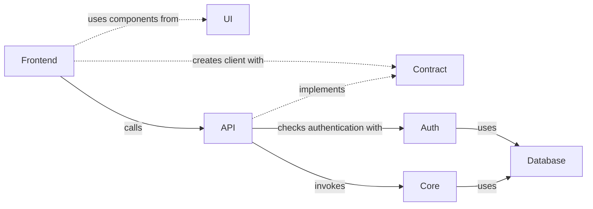
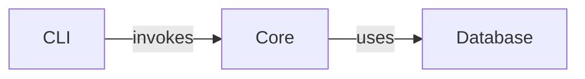
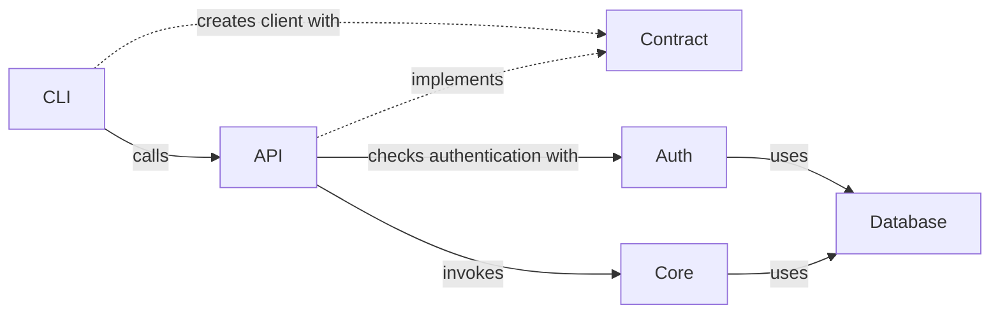

# Timetracker

## Architecture

### Project Structure

```plaintext
├── apps
│   ├── api             -> A REST API built with Hono, implements the contract and uses the core
│   ├── cli             -> A CLI with commander, used to generate the contract and the core
│   └── frontend        -> A frontend built with Vite and React, uses the contract and the core
├── packages
│   ├── auth            -> Authentication package (better-auth)
│   ├── contract        -> API Contract (orpc) implemented by the API, used as client in the frontend
│   ├── core            -> Core business logic
│   ├── db              -> Database connections and schema (drizzle)
│   └── ui              -> UI Components based on aria-react-components (installed via shadcn cli)
├── tooling
│   ├── eslint          -> ESLint for linting
│   ├── github          -> GitHub actions for CI/CD
│   ├── prettier        -> Prettier for formatting
│   ├── tailwind        -> Tailwind CSS for styling
│   ├── typescript      -> TypeScript for typing
│   └── vitest          -> Vitest for testing
├── turbo               -> Turborepo templates for generating new packages
├── commitlint.config.js
├── docker-compose.yml  -> Docker compose file for the project (Database, Mailpit, etc.)
├── package.json
├── pnpm-lock.yaml
├── pnpm-workspace.yaml
└── turbo.json
```

### Flow

#### React frontend



#### Local CLI Application



#### Remote CLI Application



Hint: _CLI authentication requires the deviceAuthorization from better-auth._
