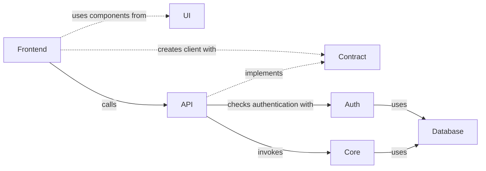
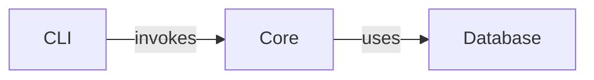
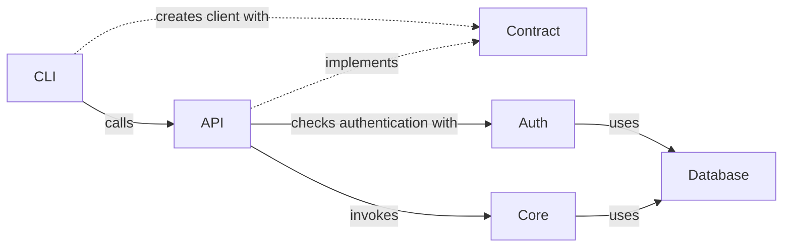

# Horva

> A self-hosted, developer-friendly time tracking app — desktop, web, and CLI, all backed by the same typed API.

[](https://github.com/ghdoergeloh/horva/actions/workflows/ci.yml)
[](https://github.com/ghdoergeloh/horva/actions/workflows/release.yml)
[](./LICENSE)
[](./CONTRIBUTING.md)

Horva is a time tracking suite built around the idea that your day is a sequence of **slots** that can optionally be attached to **tasks**, which belong to **projects** and can carry **labels**. It ships as a cross‑platform Electron desktop app, a web frontend, a REST/oRPC API, and a CLI — all sharing a single end‑to‑end typed contract.

---

## Table of contents

- [Features](#features)
- [Downloads](#downloads)
- [Screenshots](#screenshots)
- [Quick start (users)](#quick-start-users)
- [Development setup](#development-setup)
- [Project structure](#project-structure)
- [Architecture](#architecture)
- [Tech stack](#tech-stack)
- [Contributing](#contributing)
- [License](#license)

## Features

- **Slot-based time tracking** — capture continuous work intervals, with or without a task attached.
- **Tasks, projects, labels** — organize work with a lightweight, flexible hierarchy and schedule tasks for a date.
- **Cross-platform desktop app** — prebuilt binaries for macOS (`.dmg`), Windows (`.exe` / NSIS), and Linux (`AppImage`).
- **Web frontend** — React 19 + TanStack Router/Query SPA backed by the same API.
- **CLI** — scriptable access to your data, works both locally and against a remote API.
- **End-to-end typed** — a shared oRPC contract means the API, web app, and CLI can't drift out of sync.
- **Self-hosted by default** — bring your own PostgreSQL; no third-party services required.
- **OpenTelemetry-ready** — structured logging and wide events for observability.

## Downloads

Prebuilt desktop binaries are attached to each [GitHub Release](https://github.com/ghdoergeloh/horva/releases):

| Platform | Artifact                    |
| -------- | --------------------------- |
| macOS    | `Horva-<version>.dmg`       |
| Windows  | `Horva-Setup-<version>.exe` |
| Linux    | `Horva-<version>.AppImage`  |

Prefer to build from source? See [Development setup](#development-setup).

## Screenshots

> _Screenshots coming soon. Contributions welcome — see [CONTRIBUTING.md](./CONTRIBUTING.md)._

## Quick start (users)

1. Download the desktop app for your platform from the [Releases page](https://github.com/ghdoergeloh/horva/releases/latest).
2. Install and launch Horva.
3. On first launch, point the app at your PostgreSQL instance (or use the built-in local database if available on your platform build).
4. Start tracking — create a project, add tasks, and open a slot.

The desktop app bundles its own renderer; no separate web server is required for local-only usage.

## Development setup

### Prerequisites

- **Node.js** `^24.13.0`
- **pnpm** `^10.28.2`
- **Docker** + Docker Compose (for PostgreSQL and Mailpit)

### 1. Clone and install

```bash
git clone https://github.com/ghdoergeloh/horva.git
cd horva
pnpm install
```

### 2. Configure environment

```bash
cp .env.example .env
# Edit .env as needed — defaults work for local Docker Compose.
```

### 3. Start local services

```bash
docker compose up -d   # PostgreSQL + Mailpit
pnpm db:push           # Apply schema to the database
```

### 4. Run in watch mode

```bash
pnpm dev                              # Run everything (Turbo)
pnpm -F @horva/api dev                # API only
pnpm -F @horva/electron-app dev       # Electron desktop app only
pnpm -F @horva/cli dev                # CLI only
```

### Common commands

```bash
# Build & quality checks
pnpm build                # Build all workspaces
pnpm typecheck            # Type-check everything
pnpm lint                 # ESLint
pnpm lint:fix             # ESLint with --fix
pnpm format               # Prettier check
pnpm format:fix           # Prettier write

# Database
pnpm db:generate          # Generate Drizzle migrations
pnpm db:migrate           # Run migrations
pnpm db:studio            # Open Drizzle Studio

# Electron desktop app
pnpm -F @horva/electron-app dev       # Dev mode
pnpm -F @horva/electron-app build     # Build renderer + main
pnpm -F @horva/electron-app pack      # Package a distributable (.dmg / .exe / .AppImage)

# Scaffold a new package
pnpm turbo gen init
```

See [`CLAUDE.md`](./CLAUDE.md) for a deeper walkthrough of conventions, and [`docs/`](./docs) for feature specs.

## Project structure

```
.
├── apps
│   ├── api          # Hono + oRPC REST API (port 3000)
│   ├── cli          # Commander-based CLI (invokes @horva/core against a local DB)
│   └── electron     # Electron desktop app (electron-vite + electron-builder)
├── packages
│   ├── auth         # better-auth (email/password) w/ Drizzle adapter
│   ├── contract     # Shared oRPC + Zod API contract
│   ├── core         # Services, transport-agnostic handlers, shared config
│   ├── db           # Drizzle ORM + PostgreSQL schema
│   ├── transactional# Email templates
│   └── ui           # React Aria Components + Tailwind (shadcn-style)
├── tooling          # Shared ESLint / Prettier / TS / Tailwind / Vitest configs
├── docs             # Feature specs & design docs
└── turbo            # Turborepo generators for new packages
```

## Architecture

The **contract** package is the hub: `packages/contract` defines the API shape → `@horva/core/handlers` implements it → `apps/api` mounts the handlers over HTTP, and the Electron main process mounts the same handlers over IPC. Any consumer (Electron renderer, future web frontend, third-party integrations) gets full end-to-end type safety.

### Web frontend



### Local CLI



### Remote CLI



> CLI authentication uses better-auth's `deviceAuthorization` flow.

## Tech stack

- **Language**: TypeScript (strict, ESM everywhere)
- **Monorepo**: pnpm workspaces + Turborepo
- **API**: [Hono](https://hono.dev/) + [oRPC](https://orpc.unnoq.com/)
- **Web**: React 19, Vite, TanStack Router, TanStack Query, Tailwind CSS 4
- **Desktop**: Electron 35 + electron-vite + electron-builder
- **Database**: PostgreSQL + [Drizzle ORM](https://orm.drizzle.team/)
- **Auth**: [better-auth](https://www.better-auth.com/) with Drizzle adapter
- **Testing**: Vitest
- **Observability**: OpenTelemetry (OTLP-compatible exporters)

## Contributing

Contributions are warmly welcomed — bugs, features, docs, translations, or design feedback. Start with [CONTRIBUTING.md](./CONTRIBUTING.md) for the workflow, coding conventions, and commit message rules.

Good first places to look:

- Issues labeled [`good first issue`](https://github.com/ghdoergeloh/horva/labels/good%20first%20issue)
- Issues labeled [`help wanted`](https://github.com/ghdoergeloh/horva/labels/help%20wanted)
- Feature specs under [`docs/`](./docs) that don't yet have an implementation

## License

Horva is released under the [MIT License](./LICENSE).
