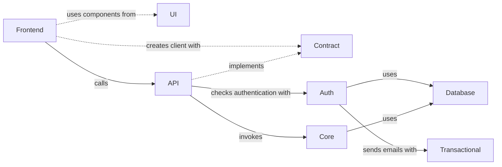
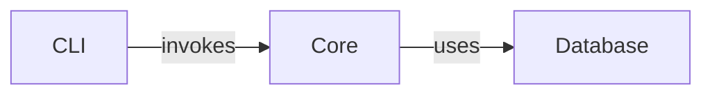
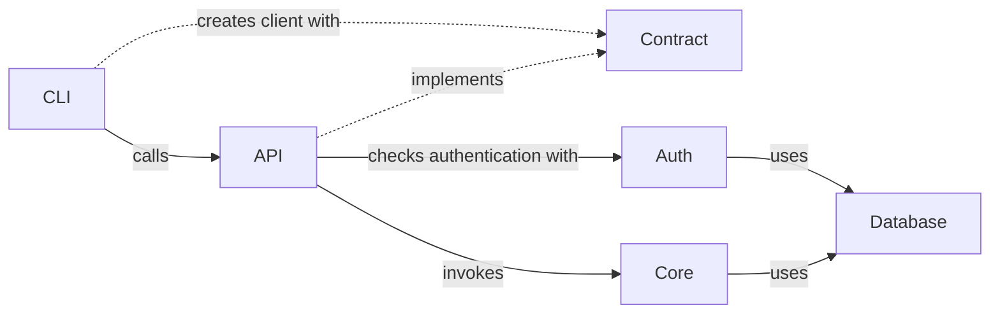

# Template for a monorepo

A pnpm + Turborepo starter: Hono API, Vite/React frontend, Commander
CLI, better-auth with email verification, Drizzle + PostgreSQL, oRPC
contracts, TanStack Router + Query, React Aria Components, Tailwind,
React Email, Vitest.

## Prerequisites

- Node.js 24 (see `.nvmrc`, `engines` in `package.json`)
- pnpm 12 (`corepack enable` picks the version from `packageManager`)
- Docker with Docker Compose (PostgreSQL and Mailpit)

## Using this template

1. Clone it (or click "Use this template" on GitHub):
   ```bash
   git clone https://github.com/ghdoergeloh/mono-repo-template my-app
   cd my-app
   ```
2. Rename the `@repo` workspace namespace to something project-specific.
   `@repo` appears in `package.json` files, tsconfig extends, lint
   configs, imports, and a handful of docs. One sweep handles all of it:
   ```bash
   git grep -l '@repo' | xargs sed -i '' 's|@repo|@myapp|g'   # macOS
   git grep -l '@repo' | xargs sed -i     's|@repo|@myapp|g'   # Linux
   ```
   Also change the project and container names in `compose.yml`.
3. Copy `.env.example` to `.env` and adjust.
4. `docker compose up -d` to bring up PostgreSQL + Mailpit.
5. `pnpm install && pnpm db:push && pnpm dev`.

The React app runs on http://localhost:5173, the API on
http://localhost:3000, the Mailpit inbox on http://localhost:8025.

## Commands

```bash
# Development
pnpm dev                          # All apps and packages in watch mode
pnpm -F @repo/api dev             # Only the API
pnpm -F @repo/react dev           # Only the React frontend

# Quality checks (CI runs all of them)
pnpm format                       # Check formatting with Oxfmt (format:fix writes)
pnpm lint                         # ESLint (lint:fix fixes)
pnpm typecheck                    # TypeScript
pnpm test:unit                    # Vitest (test:unit:coverage with coverage)
pnpm build                        # Build all workspaces
pnpm knip                         # Unused files, dependencies, exports
pnpm depcruise                    # Circular imports and package boundaries
pnpm crap                         # CRAP score report (after coverage run)

# Database (reads DATABASE_URL from .env)
pnpm db:push                      # Push the schema to the database
pnpm db:generate                  # Generate migrations
pnpm db:migrate                   # Run migrations
pnpm db:studio                    # Open Drizzle Studio
pnpm -F @repo/auth generate       # Regenerate the better-auth tables

# Scaffolding
pnpm turbo gen init               # New package
pnpm -F @repo/ui ui-add <name>    # New React Aria component (shadcn CLI)
pnpm preview:emails               # Preview the email templates
```

## Architecture

### Project Structure

```plaintext
├── apps
│   ├── api             -> REST API with Hono, implements the contract, calls the core handlers
│   ├── cli             -> CLI with Commander, calls the core directly or the API through the contract
│   └── react           -> Frontend with Vite, React, TanStack Router and Query, uses the contract
├── packages
│   ├── auth            -> Authentication (better-auth)
│   ├── contract        -> API contract (oRPC), implemented by the API, used as client in the frontend
│   ├── core            -> Business logic: services, and handlers that wire them to the contract
│   ├── db              -> Database connection and schema (Drizzle)
│   ├── transactional   -> Transactional emails (React Email, Nodemailer)
│   └── ui              -> UI components based on React Aria Components (installed via shadcn CLI)
├── tooling
│   ├── eslint          -> Shared ESLint configs
│   ├── github          -> Shared GitHub Actions setup
│   ├── quality         -> CRAP score script
│   ├── tailwind        -> Theme (design tokens) and PostCSS config
│   ├── typescript      -> Shared tsconfigs
│   └── vitest          -> Shared Vitest configs
├── turbo               -> Turborepo generators for new packages
├── .devcontainer       -> Sandboxed dev container for coding agents
├── compose.yml         -> Local services (PostgreSQL, Mailpit)
├── pnpm-workspace.yaml -> Workspaces and the dependency version catalogs
└── turbo.json
```

### Conventions

- All packages are ESM and use strict TypeScript (`tooling/typescript/base.json`).
- Dependency versions live in the catalogs in `pnpm-workspace.yaml`.
  `package.json` files reference them with `catalog:` or `catalog:react19`.
- Oxfmt formats all files and sorts imports, Tailwind classes and
  `package.json` keys (`.oxfmtrc.json`).
- Commits follow Conventional Commits (commitlint + husky). lint-staged
  formats staged files.
- UI code uses the semantic tokens from `tooling/tailwind/theme.css`, not
  raw Tailwind palette colors, so theming and dark mode work everywhere.
- Coverage thresholds in each `vitest.config.ts` only go up
  (`autoUpdate`), so coverage cannot silently drop.

### Adding an API endpoint

1. Define the route (schema, method, path) in `packages/contract/src/index.ts`.
2. Put the logic in a service in `packages/core/src/services/` and expose it
   through a handler in `packages/core/src/handlers/`.
3. Wire the handler into `apps/api/src/router.ts`.
4. The frontend and the CLI can call it right away with full type inference,
   e.g. `useQuery(orpc.user.hello.queryOptions())`.

### Flow

#### React frontend


```mermaid
flowchart LR
  Frontend -.->|uses components from| UI
  Frontend -.->|creates client with| Contract
  Frontend -->|calls| API
  API -->|checks authentication with| Auth
  API -.->|implements| Contract
  API -->|invokes| Core
  Auth -->|uses| Database
  Auth -->|sends emails with| Transactional
  Core -->|uses| Database
```

#### Local CLI Application


```mermaid
flowchart LR
  CLI -->|invokes| Core
  Core -->|uses| Database
```

#### Remote CLI Application


```mermaid
flowchart LR
  CLI -.->|creates client with| Contract
  CLI -->|calls| API
  API -->|checks authentication with| Auth
  API -.->|implements| Contract
  API -->|invokes| Core
  Auth -->|uses| Database
  Core -->|uses| Database
```

Hint: _CLI authentication requires the deviceAuthorization from better-auth._
