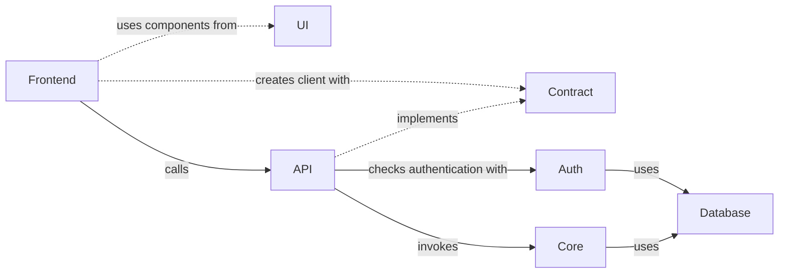
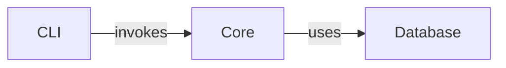
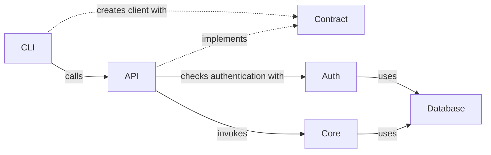

# Horva

> A self-hosted, developer-friendly time tracking app — desktop, web, and CLI, all backed by the same typed API.

[](https://github.com/ghdoergeloh/horva/actions/workflows/ci.yml)
[](https://github.com/ghdoergeloh/horva/actions/workflows/release.yml)
[](./LICENSE)
[](./CONTRIBUTING.md)

Horva is a time tracking suite built around the idea that your day is a sequence of **slots** that can optionally be attached to **tasks**, which belong to **projects** and can carry **labels**. It ships as a cross‑platform Electron desktop app, a web frontend, a REST/oRPC API, and a CLI — all sharing a single end‑to‑end typed contract.

---

## Table of contents

- [Features](#features)
- [Downloads](#downloads)
- [Screenshots](#screenshots)
- [Quick start (users)](#quick-start-users)
- [Development setup](#development-setup)
- [Project structure](#project-structure)
- [Architecture](#architecture)
- [Testing](#testing)
- [Production](#production)
- [Tech stack](#tech-stack)
- [Contributing](#contributing)
- [License](#license)

## Features

- **Slot-based time tracking** — capture continuous work intervals, with or without a task attached.
- **Tasks, projects, labels** — organize work with a lightweight, flexible hierarchy and schedule tasks for a date.
- **Cross-platform desktop app** — prebuilt binaries for macOS (`.dmg`), Windows (`.exe` / NSIS), and Linux (`AppImage`).
- **Web frontend** — React 19 + TanStack Router/Query SPA backed by the same API.
- **CLI** — scriptable access to your data, works both locally and against a remote API.
- **End-to-end typed** — a shared oRPC contract means the API, web app, and CLI can't drift out of sync.
- **Self-hosted by default** — bring your own PostgreSQL; no third-party services required.

## Downloads

Prebuilt desktop binaries are attached to each [GitHub Release](https://github.com/ghdoergeloh/horva/releases):

| Platform | Artifact                    |
| -------- | --------------------------- |
| macOS    | `Horva-<version>.dmg`       |
| Windows  | `Horva-Setup-<version>.exe` |
| Linux    | `Horva-<version>.AppImage`  |

Prefer to build from source? See [Development setup](#development-setup).

## Screenshots

> _Screenshots coming soon. Contributions welcome — see [CONTRIBUTING.md](./CONTRIBUTING.md)._

## Quick start (users)

1. Download the desktop app for your platform from the [Releases page](https://github.com/ghdoergeloh/horva/releases/latest).
2. Install and launch Horva.
3. On first launch, point the app at your PostgreSQL instance (or use the built-in local database if available on your platform build).
4. Start tracking — create a project, add tasks, and open a slot.

The desktop app bundles its own renderer; no separate web server is required for local-only usage.

## Development setup

### Prerequisites

- **Node.js** `^24.21.0`
- **pnpm** `^12.5.1`
- **Docker** + Docker Compose (for PostgreSQL and Mailpit)

### 1. Clone and install

```bash
git clone https://github.com/ghdoergeloh/horva.git
cd horva
pnpm install
```

### 2. Configure environment

```bash
cp .env.example .env
# Edit .env as needed — defaults work for local Docker Compose.
```

### 3. Start local services

```bash
docker compose up -d   # PostgreSQL + Mailpit
pnpm db:migrate        # Apply the migrations
```

### 4. Run in watch mode

```bash
pnpm dev                              # Run everything (Turbo)
pnpm -F @horva/api dev                # API only
pnpm -F @horva/react dev              # React app in the browser only (port 5173)
pnpm storybook                        # The UI components on http://localhost:6006
pnpm -F @horva/electron-app dev       # Electron desktop app only
pnpm -F @horva/cli dev                # CLI only
```

In the browser, the React app runs on http://localhost:5173. Vite forwards
`/api` to the API on port 3000, so the browser sees one origin, like in
production.

### Common commands

```bash
# Build & quality checks
pnpm build                # Build all workspaces
pnpm typecheck            # Type-check everything
pnpm lint                 # Oxlint (type-aware)
pnpm lint:fix             # Oxlint with --fix
pnpm format               # Oxfmt check
pnpm format:fix           # Oxfmt write
pnpm test:unit            # Vitest (test:unit:coverage with coverage)
pnpm test:e2e             # Playwright: the web app and the Electron app
pnpm knip                 # Unused files, dependencies, exports
pnpm depcruise            # Circular imports and package boundaries

# Database
pnpm db:generate          # Generate a migration from the schema
pnpm db:migrate           # Apply the migrations
pnpm db:push              # Push the schema without a migration (experiments only)
pnpm db:studio            # Open Drizzle Studio

# Electron desktop app
pnpm -F @horva/electron-app dev       # Dev mode
pnpm -F @horva/electron-app build     # Build main, preload and renderer (with the React app)
pnpm -F @horva/electron-app pack      # Package a distributable (.dmg / .exe / .AppImage)

# Scaffold a new package
pnpm turbo gen init
```

See [`AGENTS.md`](./AGENTS.md) for the repository rules and [`docs/`](./docs) for the status, the architecture, the decisions and the feature specs.

## Project structure

```
.
├── apps
│   ├── api          # Hono + oRPC API + better-auth; serves the built React app (port 3000)
│   ├── cli          # Commander-based CLI (invokes @horva/core against a local DB, runs migrations)
│   ├── e2e          # Playwright tests of the web app: flows, axe on every screen, smoke screenshots
│   ├── electron     # Electron desktop app: wraps apps/react (electron-vite + electron-builder)
│   └── react        # React app (Vite); runs in the browser and inside Electron
├── packages
│   ├── auth         # better-auth (email/password) w/ Drizzle adapter
│   ├── contract     # Shared oRPC + Zod API contract
│   ├── core         # Services, transport-agnostic handlers, shared config
│   ├── db           # Drizzle ORM, PostgreSQL schema, migrations, test databases (PGlite)
│   ├── transactional# Email templates
│   └── ui           # React Aria Components + Tailwind (shadcn-style), with Storybook
├── tooling          # Shared TS / Tailwind / Vitest configs, workspace checks (quality)
├── docs             # Status, architecture, decisions, feature specs
└── turbo            # Turborepo generators for new packages
```

## Architecture

The **contract** package is the hub: `packages/contract` defines the API shape → `@horva/core/handlers` implements it → `apps/api` mounts the handlers over HTTP, and the Electron main process mounts the same handlers over IPC. Any consumer (the React app, third-party integrations) gets full end-to-end type safety.

### React app and Electron

`apps/react` is the whole user interface. It runs on its own in the browser and talks to `apps/api` over HTTP. `apps/electron` wraps it: its renderer imports `@horva/react` and passes in the three parts that differ.

|                              | Browser (`apps/react/src/main.tsx`) | Electron (`apps/electron/src/renderer/src/main.tsx`) |
| ---------------------------- | ----------------------------------- | ---------------------------------------------------- |
| Backend link (`setOrpcLink`) | HTTP to `/api` on the same origin   | MessagePort to the main process                      |
| Gate before the app          | Login (better-auth)                 | Setup wizard (local database)                        |
| Router history               | Browser history                     | Hash history                                         |

### React app in the browser


```mermaid
flowchart LR
  Frontend -.->|uses components from| UI
  Frontend -.->|creates client with| Contract
  Frontend -->|calls| API
  API -->|checks authentication with| Auth
  API -.->|implements| Contract
  API -->|invokes| Core
  Auth -->|uses| Database
  Core -->|uses| Database
```

### Local CLI


```mermaid
flowchart LR
  CLI -->|invokes| Core
  Core -->|uses| Database
```

### Remote CLI


```mermaid
flowchart LR
  CLI -.->|creates client with| Contract
  CLI -->|calls| API
  API -->|checks authentication with| Auth
  API -.->|implements| Contract
  API -->|invokes| Core
  Auth -->|uses| Database
  Core -->|uses| Database
```

> CLI authentication uses better-auth's `deviceAuthorization` flow.

## Testing

Most rules of the project are tests, not text. Each check is small and
names what is wrong.

| Check                              | Where                                           |
| ---------------------------------- | ----------------------------------------------- |
| No network in unit tests           | `tooling/vitest/no-network.ts`                  |
| Every package typechecks and tests | `tooling/quality/src/workspace.spec.ts`         |
| Fixed coverage floors              | `tooling/quality/src/vitest-configs.spec.ts`    |
| Every procedure needs a session    | `apps/api/src/router.spec.ts`                   |
| Package boundaries                 | `.dependency-cruiser.cjs`                       |
| Migrations match the schema        | CI                                              |
| Contrast of all token pairs        | `packages/ui/src/test/contrast.spec.ts`         |
| No raw colors                      | `packages/ui/src/test/raw-colors.spec.ts`       |
| Screens use `@horva/ui` only       | `apps/react/src/test/ui-only.spec.ts`           |
| Stories: axe and screenshots       | `packages/ui/src/test/stories.browser.test.tsx` |
| Screens: axe, width, screenshots   | `apps/e2e/tests/screens.e2e.ts`                 |
| Electron: first launch             | `apps/electron/e2e/setup-wizard.spec.ts`        |
| Secrets, workflow security         | CI (gitleaks, actionlint, zizmor)               |

- **Database:** `createTestDatabase()` from `@horva/db/testing` gives each
  test a migrated in-memory PostgreSQL (PGlite); no running server is
  needed. Tests of locks and parallel transactions use
  `createPostgresTestDatabase()`; they run when `TEST_DATABASE_URL` is set,
  as in CI.
- **Coverage floors** are fixed numbers a little below the measured
  values. Raise them by hand; they do not rewrite themselves.
- **Screenshots**: the first story of each component (light and dark) and
  three screen combinations. They are compared on Linux arm64, where the
  references come from: the CI runner `ubuntu-24.04-arm` and the dev
  container on Apple silicon. Other systems skip only the pixel
  comparison. After an intended change:
  `pnpm -F @horva/ui exec vitest run --project stories --update` or
  `pnpm -F @horva/e2e test:e2e --update-snapshots`, then look at every new
  image.
- Story tests need Chromium: `pnpm -F @horva/ui exec playwright install chromium`.

## Production

`docker build -t horva .` builds one image with the API, the built React
app and the CLI. The API serves the app and `/api` on one origin
(`docs/decisions/0001-*`), `/health` answers while the process runs,
`/ready` when the database answers. Migrations run from the same image:

```bash
docker run --rm -e DATABASE_URL=… horva node apps/cli/dist/index.js migrate
```

The API needs `DATABASE_URL`, `BETTER_AUTH_SECRET` and `BETTER_AUTH_URL`
(the public origin). With `SMTP_HOST` and `SMTP_FROM`, new accounts must
verify their email address and password reset is on.
`apps/api/src/env.ts` lists every variable.

## Tech stack

- **Language**: TypeScript (strict, ESM everywhere)
- **Monorepo**: pnpm workspaces + Turborepo
- **API**: [Hono](https://hono.dev/) + [oRPC](https://orpc.unnoq.com/)
- **Web**: React 19, Vite, TanStack Router, TanStack Query, Tailwind CSS 4
- **Desktop**: Electron 44 + electron-vite + electron-builder
- **Database**: PostgreSQL + [Drizzle ORM](https://orm.drizzle.team/)
- **Auth**: [better-auth](https://www.better-auth.com/) with Drizzle adapter
- **Testing**: Vitest (with PGlite), Storybook story tests in Chromium, Playwright (web and Electron), axe

## Contributing

Contributions are warmly welcomed — bugs, features, docs, translations, or design feedback. Start with [CONTRIBUTING.md](./CONTRIBUTING.md) for the workflow, coding conventions, and commit message rules.

Good first places to look:

- Issues labeled [`good first issue`](https://github.com/ghdoergeloh/horva/labels/good%20first%20issue)
- Issues labeled [`help wanted`](https://github.com/ghdoergeloh/horva/labels/help%20wanted)
- Feature specs under [`docs/`](./docs) that don't yet have an implementation

## License

Horva is released under the [MIT License](./LICENSE).
